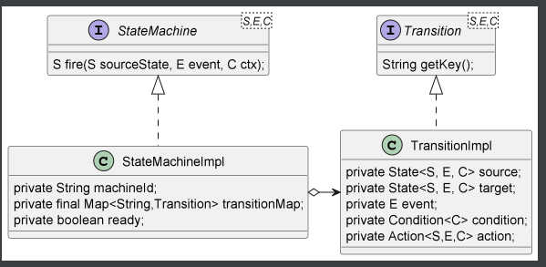

## simple-statemachine: 极简高性能状态机框架

🚀 简介 🚀 simple-statemachine 是一款灵感来源于 cola-statemachine 与 spring-statemachine
的革命性状态机实现，专为追求极致性能与简洁设计的开发者而生。它摒弃了复杂的配置与依赖，专注于提供一个轻量级、无状态且高度可扩展的状态机解决方案，旨在帮助您快速构建稳定、高效的应用系统。



## 特性亮点

- 极简设计：采用直观的API设计，上手即用，无需繁琐配置。
- 高性能：无状态设计，减少内存占用，提升运行效率。
- 零依赖：不依赖任何外部库，确保最小化引入的复杂度。
- 灵活扩展：支持自定义状态转换逻辑，轻松应对复杂业务场景。
- 全面兼容：无缝集成Java项目，无论是Spring Boot应用还是原生Java应用均能完美适配。

## 快速开始

- 添加依赖 对于Maven项目，只需在pom.xml中添加以下依赖：

```java
<dependency>
    <groupId>org.simple</groupId>
    <artifactId>simple-statemachine</artifactId>
    <version>1.0-SNAPSHOT</version>
</dependency>
```

- 创建并使用状态机

```java
 class StateMachineImplTest {
    /**
     * 定义库位状态：空库位，满库位
     */
    enum WarehouseState {
        EMPTY, FULL
    }

    /**
     * 定义库位事件：取走，放入
     */
    enum WarehouseEvent {
        TAKE_AWAY, PUT_IN
    }


    @Test
    public void testCreateFsm() {
        StateMachineBuilder<WarehouseState, WarehouseEvent, Object> fsmBuilder = StateMachineBuilderImpl.create();
        fsmBuilder.transition()
                .from(WarehouseState.EMPTY)
                .to(WarehouseState.FULL)
                .on(WarehouseEvent.PUT_IN)
                .when(c -> c != null)
                .then((start, end, event, context) -> {
                    System.out.println(String.format("sourceState:%s，targetState：%s,event:%s,context:%s", start, end, event, context));
                });
        fsmBuilder.transition()
                .from(WarehouseState.FULL)
                .to(WarehouseState.EMPTY)
                .on(WarehouseEvent.TAKE_AWAY)
                .when(c -> c != null)
                .then((start, end, event, context) -> {
                    System.out.println(String.format("sourceState:%s，targetState：%s,event:%s,context:%s", start, end, event, context));
                });
        StateMachine<WarehouseState, WarehouseEvent, Object> stateMachine = fsmBuilder.build("库位状态机");

        WarehouseState S1 = stateMachine.fire(WarehouseState.EMPTY, WarehouseEvent.PUT_IN, "context");
        Assertions.assertTrue(S1 == WarehouseState.FULL);

        WarehouseState S3 = stateMachine.fire(WarehouseState.FULL, WarehouseEvent.TAKE_AWAY, "context");
        Assertions.assertTrue(S3 == WarehouseState.EMPTY);
    }
}
```

## 文档与支持

完整文档：访问 项目GitHub页面 查看详细的使用手册和API文档。 示例代码：包含丰富的示例项目，覆盖基础到高级用法，助您快速上手。 社区支持：加入我们的钉钉/Slack群组，与其他开发者交流心得，获取即时帮助。

## 贡献指南

我们热烈欢迎任何形式的贡献，包括但不限于bug报告、功能建议或代码提交。请遵循我们的贡献指南，共同推动 simple-statemachine 的发展。

:star: 立即开始使用 simple-statemachine，让您的状态管理变得前所未有的简单与高效！
